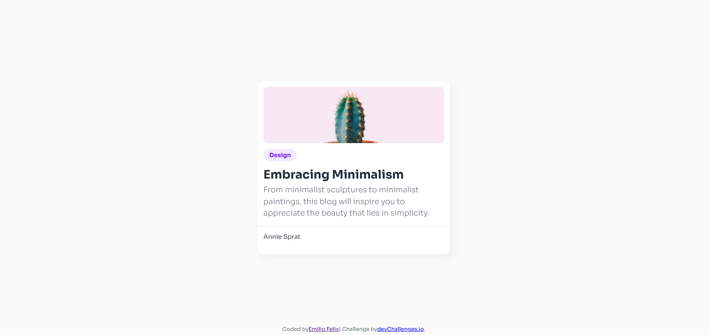

<!-- Please update value in the {}  -->

<h1 align="center">Minimal Blog Card | devChallenges</h1>

   Solution for a challenge <a href="https://devchallenges.io/challenge/minimal-blog-card" target="_blank">Minimal Blog Card</a> from <a href="http://devchallenges.io" target="_blank">devChallenges.io</a>.

  <h3>
    <a href="{https://your-demo-link.your-domain}">
      Demo
    </a>
     | 
    <a href="{https://your-url-to-the-solution}">
      Solution
    </a>
     | 
    <a href="https://devchallenges.io/challenge/minimal-blog-card">
      Challenge
    </a>
  </h3>

<!-- TABLE OF CONTENTS -->

## Table of Contents

- [Overview](#overview)
  - [What I learned](#what-i-learned)
  - [Useful resources](#useful-resources)
- [Built with](#built-with)
- [Features](#features)
- [Contact](#contact)
- [Acknowledgements](#acknowledgements)

<!-- OVERVIEW -->

## Overview

This is my solution to the Minimalist Blog Card challenge from DevChallenges. The focus was on building a responsive, pixel-perfect UI component directly from a design spec, making sure it scales properly from mobile devices to full desktop screens.

### What I learned

This project forced me to get a solid grip on CSS layout mechanics and the box model, specifically how to handle container spacing without breaking the layout.

I learned to stop throwing global padding on the main card wrapper. By removing padding from the parent card and applying it directly to the child containers (header, info, footer), I was able to make the horizontal line span exactly 100% of the width, edge-to-edge.

I used object-fit: cover on the image to keep it fully responsive without squashing or stretching the file inside the container.

### Built with

<!-- This section should list any major frameworks that you built your project using. Here are a few examples.-->

- Semantic HTML5 markup
- CSS custom properties
- Flexbox
- Responsive media queries

## Author

- GitHub [@efelixdev](https://github.com/emiliofelixdev)
